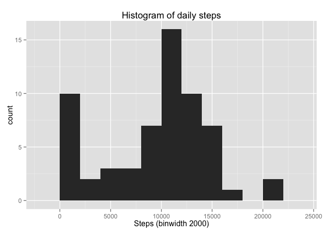
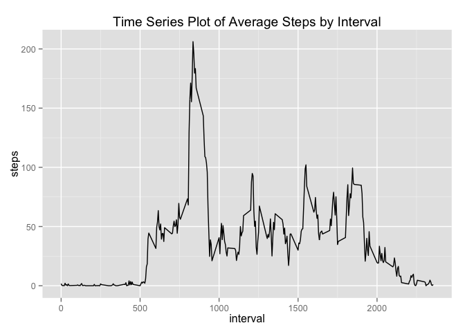
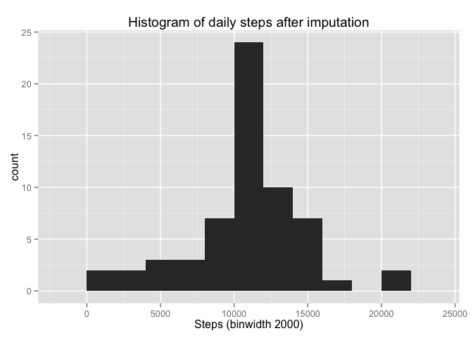
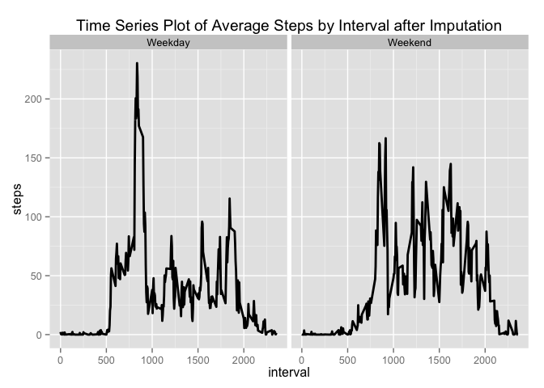

# Reproducible Research: Peer Assessment 1


## Loading and preprocessing the data

---

- Load the data


```r
df = read.csv('activity.csv', header=T)
```

- Process/transform the data


```r
df$date <- as.Date(df$date)
```


## What is mean total number of steps taken per day?

---

- Calculate the total number of steps taken per day


```r
total.steps.by.day <- aggregate(x=df$steps, by=list(df$date), FUN=sum, na.rm=T)
```

- I do not understand the difference between a histogram and a barplot, research the difference between them. Make a histogram of the total number of steps taken each day


```r
library(ggplot2)
names(total.steps.by.day) <- c("date", "steps")
histplot <- ggplot(total.steps.by.day, aes(x=steps)) + 
    ggtitle("Histogram of daily steps") + 
    xlab("Steps (binwidth 2000)") + 
    geom_histogram(binwidth=2000)
histplot
```

 

- Calculate and report the mean and median of the total number of steps taken per day


```r
mean(total.steps.by.day$steps, na.rm=T)
```

```
## [1] 9354.23
```

```r
median(total.steps.by.day$steps, na.rm=T)
```

```
## [1] 10395
```


## What is the average daily activity pattern?

---

- Make a time series plot of the 5-minute interval and the average number of steps token, averaged across all days.


```r
avg.steps.by.interval <- aggregate(x=df$steps, by=list(df$interval), FUN=mean, na.rm=T)
names(avg.steps.by.interval) <- c("interval", "steps")

avg.step.line <- ggplot(avg.steps.by.interval, aes(interval, steps)) +
    ggtitle("Time Series Plot of Average Steps by Interval") +
    geom_line()
avg.step.line
```

 

- 5-minute interval, on average across all the days in the dataset, contains the maximum number of steps.


```r
avg.steps.by.interval[which.max(avg.steps.by.interval$steps), c("interval")]
```

```
## [1] 835
```

## Imputing missing values

---

- Calculate and report the total number of missing values in the dataset.


```r
nrow(df[is.na(df$steps),])
```

```
## [1] 2304
```

- Devise a strategy for filling in all of the missing values in the dataset.


```r
df.imputed <- merge(x=df, y=avg.steps.by.interval, by="interval", all.x=T)
df.imputed[is.na(df.imputed$steps.x), c("steps.x")] <- df.imputed[is.na(df.imputed$steps.x), c("steps.y")]
```

- Create a new dataset that is equal to the original dataset but with the missing data filled in.


```r
df.imputed$date <- as.Date(df.imputed$date)
df.imputed$date.x <- NULL
df.imputed$Group.1 <- NULL
df.imputed$steps <- df.imputed$steps.x
df.imputed$steps.x <- NULL
df.imputed$steps.y <- NULL
```

- Make a histogram of the total number of steps taken each day and Calculate and reprot the mean and median total number of steps taken per day.


```r
total.steps.by.day <- aggregate(x=df.imputed$steps, by=list(df.imputed$date), FUN=sum, na.rm=T)
names(total.steps.by.day) <- c("date", "steps")
histplot <- ggplot(total.steps.by.day, aes(x=steps)) +
    ggtitle("Histogram of daily steps after imputation") +
    xlab("Steps (binwidth 2000)") +
    geom_histogram(binwidth = 2000)
histplot
```

 


```r
mean(total.steps.by.day$steps, na.rm=T)
```

```
## [1] 10766.19
```

```r
median(total.steps.by.day$steps, na.rm=T)
```

```
## [1] 10766.19
```


## Are there differences in activity patterns between weekdays and weekends?

---

- Create a new factor variable in the dataset with two levels - "weekday" and "weekend" indicating whether a given date is a weekday or weekend day.


```r
Sys.setlocale("LC_TIME", "en_US")
```

```
## [1] "en_US"
```

```r
df.imputed$weekday <- as.factor(ifelse(weekdays(df.imputed$date) %in% c("Saturday", "Sunday"), "Weekend", "Weekday"))
table(df.imputed$weekday)
```

```
## 
## Weekday Weekend 
##   12960    4608
```

- Make a panel plot containing a time series plot of the 5-minute interval and the average number of steps taken, averaged across all weekday days or weekend days.


```r
agg.by <- list(df.imputed$interval, df.imputed$weekday)
avg.steps.by.interval.and.wd <- aggregate(x=df.imputed$steps, by = agg.by, FUN = mean, na.rm=T)
names(avg.steps.by.interval.and.wd) <- c("interval", "weekday", "steps")
avg.step.line <- ggplot(avg.steps.by.interval.and.wd, aes(interval, steps)) +
    ggtitle("Time Series Plot of Average Steps by Interval after Imputation") +
    facet_grid(. ~ weekday) +
    geom_line(size = 1)
avg.step.line
```

 
